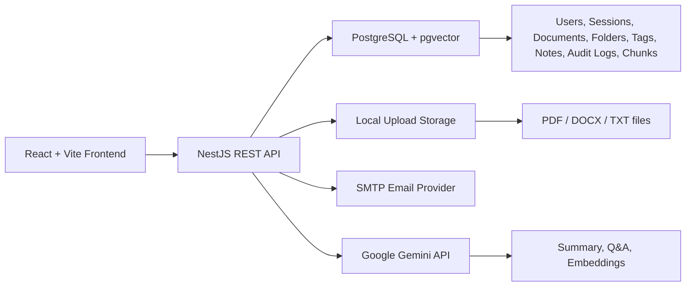
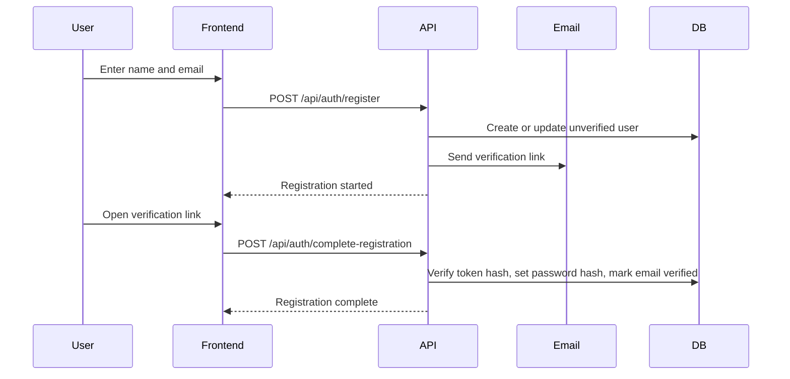
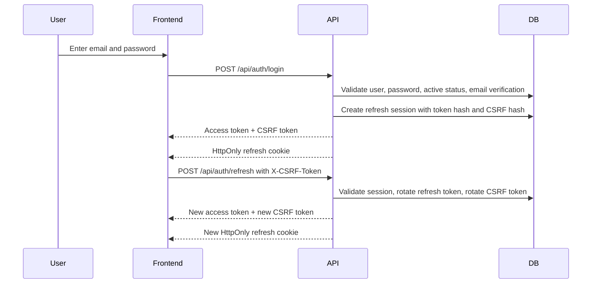
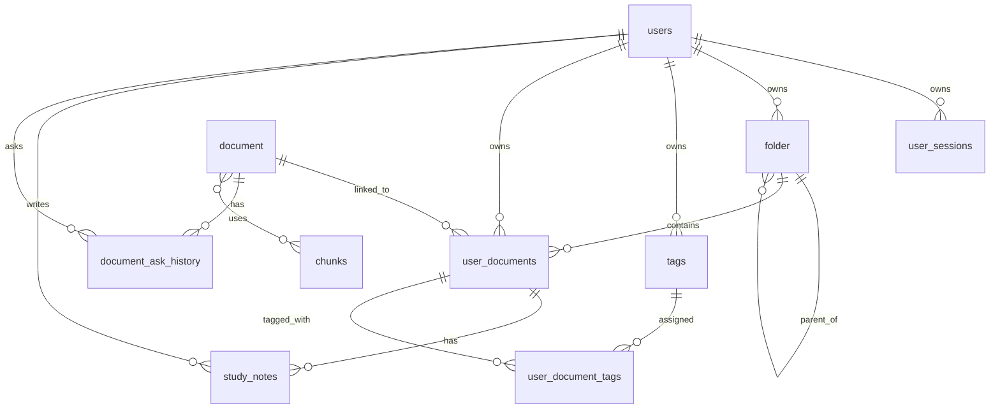

# StudyVault Final Project Submission

This document is the main submission packet for the IWS final project. It summarizes the system, implemented features, authentication and authorization design, database schema, API surface, and demo script.

Last updated: 2026-05-02.

## 1. System Overview

StudyVault is a study document management system for students. The application includes a public landing page, then lets users register, verify their email, log in, organize files into folders and tags, upload study documents, preview documents, search their library, save study notes, and use AI-assisted document features such as summary and question answering.

### Architecture



### Main Components

| Component | Technology | Responsibility |
| --- | --- | --- |
| Frontend | React, Vite, Tailwind CSS, Axios | User interface, routing, document workspace, viewer, admin dashboard |
| Backend | NestJS, TypeScript | REST APIs, authentication, authorization, validation, document processing |
| Database | PostgreSQL, TypeORM, pgvector | Persistent data, ownership relations, AI chunk embeddings |
| Email | SMTP / Gmail App Password | Email verification and password reset |
| AI | Google Gemini | Summary, Q&A, diagram/mind-map support, embeddings |
| Runtime | Docker Compose | Local demo stack for frontend, backend, and database |

### Core Design Decisions

- Authentication is separated from authorization.
- Public registration only creates normal user accounts.
- Admin accounts are created through a controlled bootstrap configuration.
- Workspace data is owner-scoped: users can only access their own documents, folders, tags, and notes.
- File upload does not depend on AI quota. The document is saved first; AI indexing runs separately.
- Refresh tokens are stored in HttpOnly cookies and protected with CSRF tokens.

## 2. Feature List

### Authentication and Account Management

| Feature | Status | Notes |
| --- | --- | --- |
| Register with name and email | Complete | User receives email verification link |
| Email verification | Complete | User sets password from verification token |
| Login | Complete | Issues short-lived access token and refresh session |
| Logout | Complete | Revokes current refresh session |
| Logout all sessions | Complete | Revokes all user refresh sessions |
| Forgot password | Complete | Neutral response prevents account enumeration |
| Reset password | Complete | Token is hashed in database |
| Change password | Complete | Requires current password and revokes sessions |
| Profile read/update | Complete | Authenticated user only |
| Strong password policy | Complete | Minimum 12 characters with complexity requirement |

### Document Workspace

| Feature | Status | Notes |
| --- | --- | --- |
| Upload documents | Complete | Supports PDF, DOCX, TXT |
| Validate upload file | Complete | Checks size, supported type, filename safety, readable content |
| Preview document | Complete | File endpoint is owner-protected |
| List documents | Complete | Supports pagination/filter data |
| Search documents | Complete | Uses authenticated owner scope |
| Sort and filter documents | Complete | Type, tag, folder, favorite, and sort flows |
| Rename document | Complete | Owner-only |
| Delete document | Complete | Owner-only |
| Toggle favorite | Complete | Owner-only |
| Related documents | Complete | Owner-only |
| Same file in multiple folders | Complete | Allowed across different folders for the same user |
| Duplicate file in the same folder | Complete | Rejected with a clear validation error |
| Re-upload after deletion | Complete | Allowed after the document entry is deleted from that folder |

### Folder, Tag, and Notes

| Feature | Status | Notes |
| --- | --- | --- |
| Folder CRUD | Complete | Folder tree is owner-scoped |
| Move folder | Complete | Source and target parent must belong to same owner |
| Add/remove document from folder | Complete | Both document and folder must belong to user |
| Tag CRUD | Complete | Tags are private per user |
| Assign tags to document | Complete | Document and tags must belong to same user |
| Study notes CRUD | Complete | Notes are tied to user's document relation |

### AI Features

| Feature | Status | Notes |
| --- | --- | --- |
| Background document indexing | Complete | Upload succeeds even if AI indexing fails |
| Ask document | Complete | Uses owner-scoped document context |
| Ask history | Complete | User-specific history |
| Summary generation | Complete | User-document scoped when user-specific input can affect output |
| Mind map / diagram endpoints | Complete | Backend AI-assisted document understanding endpoints |
| Document assistant UI | Complete | Study notes, Summary, Ask AI, and Related tabs |

### Admin Features

| Feature | Status | Notes |
| --- | --- | --- |
| Admin bootstrap | Complete | Uses `ADMIN_EMAILS` and `ADMIN_BOOTSTRAP_PASSWORD` |
| List users | Complete | Admin-only |
| Lock/unlock users | Complete | Admin cannot lock self or another admin |
| Audit log | Complete | Records admin user status actions |
| Admin stats | Complete | Dashboard summary |
| LLM diagnostic endpoints | Complete | Admin-only |

## 3. Authentication Flow

### Registration and Email Verification



### Login and Refresh Session



### Security Controls

| Control | Implementation |
| --- | --- |
| Password storage | Bcrypt hash |
| Email verification token | Random token sent by email; only hash stored |
| Reset password token | Random token sent by email; only hash stored |
| Access token | Short-lived JWT, stored in frontend memory only |
| Refresh token | HttpOnly cookie, hash stored server-side |
| CSRF protection | `X-CSRF-Token` required for refresh/logout cookie actions |
| Session revoke | Logout, logout-all, password reset/change, admin lock |
| Refresh token reuse detection | Reuse of rotated/revoked token revokes active sessions |
| Account enumeration protection | Neutral forgot-password response |

## 4. Authorization Matrix

Full detailed matrix: [authorization-matrix.md](./authorization-matrix.md)

| API Area | Guest | User | Admin | Rule |
| --- | --- | --- | --- | --- |
| Register, login, verification, password recovery | Allowed | Allowed | Allowed | Public authentication flows |
| Profile and password | Blocked | Own account | Own account | Requires active JWT |
| Documents | Blocked | Own resources only | Own resources only | Admin does not bypass document ownership |
| Folders | Blocked | Own resources only | Own resources only | `ownerId` enforced |
| Tags | Blocked | Own resources only | Own resources only | `ownerId` enforced |
| Study notes | Blocked | Own resources only | Own resources only | `userId` and `userDocumentId` enforced |
| RAG / AI document APIs | Blocked | Own documents only | Own documents only | AI runs only after owner check |
| Admin user management | Blocked | Blocked | Allowed | Requires `JwtAuthGuard` and `RolesGuard` |
| LLM diagnostic APIs | Blocked | Blocked | Allowed | Admin-only |
| Health endpoint | Allowed | Allowed | Allowed | Read-only system readiness |

### Cross-User Access Rule

User A cannot access User B's document, folder, tag, note, or RAG context. Services query resources with the authenticated `ownerId` or `userId`. Cross-user access returns a not-found style response instead of confirming whether the resource exists.

| Resource | Cross-user access result |
| --- | --- |
| Document detail/file/update/delete | Blocked |
| Folder read/update/move/delete | Blocked |
| Tag read/update/delete | Blocked |
| Study note read/update/delete | Blocked |
| RAG ask/history/summary/mindmap/diagram | Blocked |

## 5. Database Schema

### Entity Relationship Overview



### Tables

| Table | Purpose | Key Fields |
| --- | --- | --- |
| `users` | Accounts and account state | email, password hash, role, active flag, email verification fields, reset token fields |
| `user_sessions` | Refresh sessions | user id, refresh token hash, CSRF hash, expiry, revoked time, IP, user agent |
| `document` | Shared document content record | title, metadata, file path, file size, content hash, status |
| `chunks` | Text chunks for search/RAG | chunk text, token count, embedding, embedding model |
| `document_chunks` | Many-to-many relation | document id, chunk id |
| `user_documents` | User-specific document library entry | user, document, folder, display name, favorite flag |
| `folder` | User folder tree | owner id, name, parent id |
| `tags` | User-owned tags | owner id, name, type, color |
| `user_document_tags` | Document-tag assignment | user document id, tag id |
| `study_notes` | User notes on documents | user id, user document id, content |
| `document_ask_history` | AI Q&A history | user, document, question, answer, sources |
| `admin_audit_logs` | Admin action audit trail | admin id, target user id, action, metadata |

### Important Relationships

- `users -> user_documents -> document`: separates document content from each user's library entry.
- Same-file uploads are checked per folder: a user may keep the same file in different folders, but cannot upload that file twice into the same folder.
- `users -> folder`: folders are private to the owner.
- `users -> tags`: tags are private to the owner.
- `user_documents -> study_notes`: notes belong to the user's relation to a document.
- `document -> chunks`: chunks support search and AI context retrieval.
- `users -> user_sessions`: refresh sessions can be revoked individually or in bulk.

## 6. API Summary

Base URL for local Docker demo: `http://localhost:8000/api`

### System

| Method | Endpoint | Auth | Purpose |
| --- | --- | --- | --- |
| `GET` | `/` | Public | Basic API smoke check |
| `GET` | `/health` | Public | API and database readiness |

### Authentication

| Method | Endpoint | Auth | Purpose |
| --- | --- | --- | --- |
| `POST` | `/auth/register` | Public | Start registration |
| `POST` | `/auth/login` | Public | Login and create session |
| `POST` | `/auth/refresh` | Refresh cookie + CSRF | Rotate refresh session and issue access token |
| `POST` | `/auth/logout` | Optional refresh cookie + CSRF | Revoke current session |
| `POST` | `/auth/logout-all` | JWT + refresh cookie + CSRF | Revoke all user sessions |
| `POST` | `/auth/forgot-password` | Public | Send reset email when eligible |
| `POST` | `/auth/complete-registration` | Public | Verify email and set password |
| `POST` | `/auth/resend-verification` | Public | Resend verification email |
| `POST` | `/auth/reset-password` | Public | Reset password from token |
| `GET` | `/auth/profile` | JWT | Get own profile |
| `PATCH` | `/auth/profile` | JWT | Update own profile |
| `PATCH` | `/auth/password` | JWT | Change password |

### Documents

| Method | Endpoint | Auth | Purpose |
| --- | --- | --- | --- |
| `GET` | `/documents` | JWT | List own documents |
| `POST` | `/documents/upload` | JWT | Upload PDF/DOCX/TXT |
| `GET` | `/documents/favorites` | JWT | List favorite documents |
| `GET` | `/documents/search` | JWT | Search own documents |
| `GET` | `/documents/:id` | JWT | Get document details |
| `GET` | `/documents/:id/file` | JWT | Serve protected document file |
| `GET` | `/documents/:id/related` | JWT | Related documents |
| `PATCH` | `/documents/:id` | JWT | Rename document |
| `DELETE` | `/documents/:id` | JWT | Delete document |
| `POST` | `/documents/:id/toggle-favorite` | JWT | Toggle favorite |
| `GET` | `/documents/:id/tags` | JWT | List document tags |
| `PATCH` | `/documents/:id/tags` | JWT | Replace document tags |
| `GET` | `/documents/:id/notes` | JWT | List study notes |
| `POST` | `/documents/:id/notes` | JWT | Create study note |
| `PATCH` | `/documents/notes/:noteId` | JWT | Update study note |
| `DELETE` | `/documents/notes/:noteId` | JWT | Delete study note |

### Folders

| Method | Endpoint | Auth | Purpose |
| --- | --- | --- | --- |
| `GET` | `/folders` | JWT | List own folders |
| `GET` | `/folders/:id` | JWT | Get folder details |
| `POST` | `/folders` | JWT | Create folder |
| `PATCH` | `/folders/:id` | JWT | Update folder |
| `PATCH` | `/folders/:id/move` | JWT | Move folder |
| `DELETE` | `/folders/:id` | JWT | Delete folder |
| `POST` | `/folders/documents/add` | JWT | Add document to folder |
| `DELETE` | `/folders/documents/remove` | JWT | Remove document from folder |
| `GET` | `/folders/:folderId/documents` | JWT | List documents in folder |

### Tags

| Method | Endpoint | Auth | Purpose |
| --- | --- | --- | --- |
| `GET` | `/tags` | JWT | List own tags |
| `POST` | `/tags` | JWT | Create tag |
| `PATCH` | `/tags/:tagId` | JWT | Update tag |
| `DELETE` | `/tags/:tagId` | JWT | Delete tag |

### RAG / AI

| Method | Endpoint | Auth | Purpose |
| --- | --- | --- | --- |
| `POST` | `/rag/documents/:documentId/ask` | JWT | Ask a question about a document |
| `GET` | `/rag/documents/:documentId/ask/history` | JWT | Get ask history |
| `DELETE` | `/rag/documents/:documentId/ask/history` | JWT | Clear ask history |
| `POST` | `/rag/documents/:documentId/summary` | JWT | Generate summary |
| `GET` | `/rag/documents/:documentId/summary` | JWT | Get cached summary state |
| `POST` | `/rag/documents/:documentId/mindmap` | JWT | Generate mind map |
| `POST` | `/rag/documents/:documentId/diagram` | JWT | Generate diagram |

### Admin

| Method | Endpoint | Auth | Purpose |
| --- | --- | --- | --- |
| `GET` | `/admin/users` | Admin JWT | List users |
| `GET` | `/admin/audit-logs` | Admin JWT | List admin audit logs |
| `PATCH` | `/admin/users/:id/status` | Admin JWT | Lock/unlock normal users |
| `GET` | `/admin/stats` | Admin JWT | Dashboard stats |
| `GET` | `/llm/test` | Admin JWT | LLM text diagnostic |
| `GET` | `/llm/test-embedding` | Admin JWT | Embedding diagnostic |

## 7. Demo Script

Detailed runbook: [demo-runbook.md](./demo-runbook.md)

### Pre-Demo Setup

1. Copy environment template:

```powershell
copy docker.env.example .env
```

2. Fill these values in `.env` if the demo needs real email and AI:

```text
SMTP_USER=
SMTP_PASS=
GEMINI_API_KEY=
ADMIN_EMAILS=admin@example.com
ADMIN_BOOTSTRAP_PASSWORD=Admin#12345678
```

3. Start the stack:

```powershell
docker compose up --build
```

4. Run readiness check:

```powershell
powershell -ExecutionPolicy Bypass -File .\scripts\demo-readiness.ps1
```

### Live Demo Flow

1. Open `http://localhost:3000`.
2. Show the public landing page and the call to action.
3. Register a new user with name and email.
4. Open the verification email and complete registration with a strong password.
5. Log in.
6. Show workspace and empty state or current document list.
7. Upload a PDF, DOCX, or TXT document.
8. Open the uploaded document viewer.
9. Show document preview, study notes, summary, Ask AI, related documents, favorite toggle, download, filters, tags, and folders.
10. Show the per-folder duplicate rule by uploading the same file into another folder and explaining same-folder duplicate rejection.
11. Run summary or Q&A if `GEMINI_API_KEY` has quota.
12. Explain that upload/view still works if AI quota is exhausted because AI indexing is background processing.
13. Log in as admin.
14. Show user management, lock/unlock normal user, and audit logs.
15. Log out and refresh page to show session cleanup.

### Demo Talking Points

- StudyVault is a full-stack document learning platform, not only a static CRUD app.
- Authentication uses email verification, password reset, short-lived JWTs, refresh sessions, and CSRF protection.
- Authorization is enforced at route level and data ownership level.
- Admin is restricted to system management and does not bypass user document ownership.
- Upload is robust: files are validated and saved even when AI quota fails.
- The system has automated backend unit/e2e tests and frontend tests for important flows.

### Quick Verification Commands

Backend:

```powershell
cd studyVault-backend
npm run lint
npm test -- --runInBand
npm run test:e2e -- --runInBand
npm run build
```

Frontend:

```powershell
cd studyVault-frontend
npm run lint
npm test
npm run build
```

## 8. Supporting Documents

| Document | Purpose |
| --- | --- |
| [authorization-matrix.md](./authorization-matrix.md) | Detailed access control matrix |
| [security-architecture-and-demo.md](./security-architecture-and-demo.md) | Security flow and demo evidence |
| [demo-runbook.md](./demo-runbook.md) | Step-by-step demo checklist |
| [production-deployment.md](./production-deployment.md) | Docker deployment notes |
| [project-scope-final.md](./project-scope-final.md) | Final scope and implementation direction |
