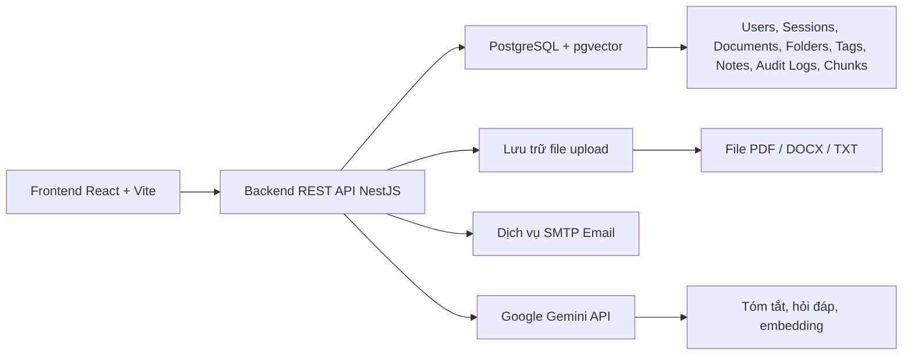
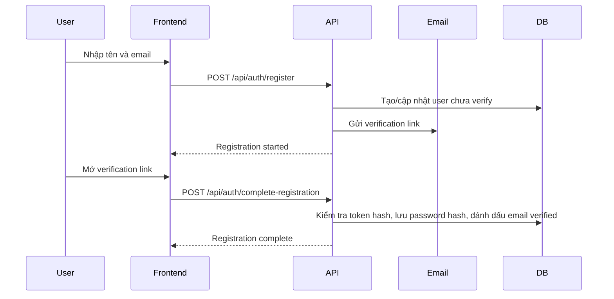
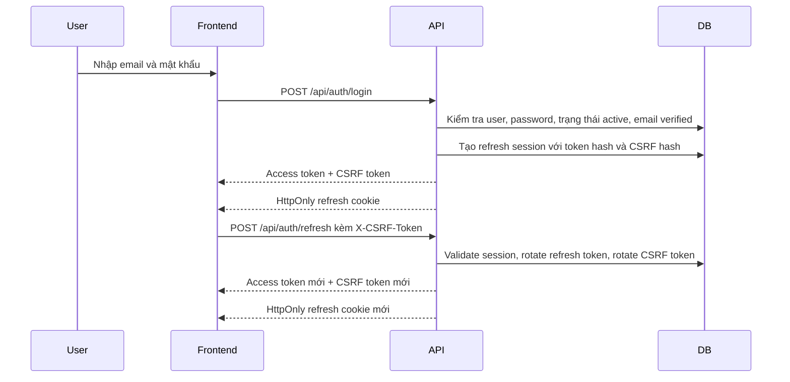
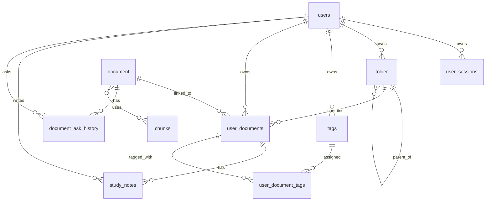

# Báo Cáo Nộp Final Project StudyVault

Tài liệu này là bản nộp chính cho final project môn IWS. Nội dung tổng hợp các phần: tổng quan hệ thống, danh sách chức năng, luồng xác thực, ma trận phân quyền, thiết kế cơ sở dữ liệu, tóm tắt API, và kịch bản demo.

## 1. Tổng Quan Hệ Thống

StudyVault là hệ thống quản lý tài liệu học tập dành cho sinh viên. Ứng dụng cho phép người dùng đăng ký tài khoản, xác thực email, đăng nhập, tổ chức tài liệu theo thư mục và tag, tải tài liệu học tập lên, xem trước tài liệu, tìm kiếm trong thư viện cá nhân, ghi chú học tập, và sử dụng các chức năng AI như tóm tắt tài liệu hoặc hỏi đáp theo nội dung tài liệu.

### Kiến Trúc Tổng Thể



### Các Thành Phần Chính

| Thành phần | Công nghệ | Vai trò |
| --- | --- | --- |
| Frontend | React, Vite, Tailwind CSS, Axios | Giao diện người dùng, routing, workspace tài liệu, document viewer, admin dashboard |
| Backend | NestJS, TypeScript | REST API, xác thực, phân quyền, validation, xử lý tài liệu |
| Database | PostgreSQL, TypeORM, pgvector | Lưu dữ liệu, quan hệ sở hữu, embedding phục vụ AI |
| Email | SMTP / Gmail App Password | Gửi email xác thực tài khoản và reset password |
| AI | Google Gemini | Tóm tắt, hỏi đáp, mind map/diagram, embedding |
| Runtime | Docker Compose | Chạy local demo gồm frontend, backend, database |

### Quyết Định Thiết Kế Chính

- Authentication và authorization được tách riêng rõ ràng.
- Public registration chỉ tạo tài khoản người dùng thường, không tự cấp quyền admin.
- Admin được tạo bằng cơ chế bootstrap có kiểm soát qua cấu hình môi trường.
- Dữ liệu workspace được giới hạn theo chủ sở hữu: người dùng chỉ truy cập được document, folder, tag, note của chính mình.
- Upload tài liệu không phụ thuộc quota AI. File và record được lưu trước, AI indexing chạy riêng sau đó.
- Refresh token nằm trong HttpOnly cookie và được bảo vệ bằng CSRF token.

## 2. Danh Sách Chức Năng

### Authentication Và Quản Lý Tài Khoản

| Chức năng | Trạng thái | Ghi chú |
| --- | --- | --- |
| Đăng ký bằng tên và email | Hoàn thành | Gửi link xác thực email |
| Xác thực email | Hoàn thành | Người dùng đặt mật khẩu từ verification token |
| Đăng nhập | Hoàn thành | Cấp access token ngắn hạn và refresh session |
| Đăng xuất | Hoàn thành | Thu hồi refresh session hiện tại |
| Đăng xuất tất cả phiên | Hoàn thành | Thu hồi toàn bộ refresh session của user |
| Quên mật khẩu | Hoàn thành | Phản hồi trung lập để tránh dò tài khoản |
| Đặt lại mật khẩu | Hoàn thành | Token chỉ lưu dạng hash trong database |
| Đổi mật khẩu | Hoàn thành | Yêu cầu mật khẩu hiện tại và revoke session |
| Xem/cập nhật profile | Hoàn thành | Chỉ tài khoản đang đăng nhập |
| Chính sách mật khẩu mạnh | Hoàn thành | Tối thiểu 12 ký tự, có yêu cầu độ phức tạp |

### Workspace Tài Liệu

| Chức năng | Trạng thái | Ghi chú |
| --- | --- | --- |
| Upload tài liệu | Hoàn thành | Hỗ trợ PDF, DOCX, TXT |
| Validate file upload | Hoàn thành | Kiểm tra size, loại file, tên file, nội dung có đọc được không |
| Xem tài liệu | Hoàn thành | Endpoint file được bảo vệ theo owner |
| Danh sách tài liệu | Hoàn thành | Có pagination và filter data |
| Tìm kiếm tài liệu | Hoàn thành | Chỉ tìm trong tài liệu của user hiện tại |
| Lọc/sắp xếp tài liệu | Hoàn thành | Theo type, tag, folder, favorite, sort |
| Đổi tên tài liệu | Hoàn thành | Owner-only |
| Xóa tài liệu | Hoàn thành | Owner-only |
| Đánh dấu yêu thích | Hoàn thành | Owner-only |
| Tài liệu liên quan | Hoàn thành | Owner-only |

### Folder, Tag Và Study Notes

| Chức năng | Trạng thái | Ghi chú |
| --- | --- | --- |
| CRUD folder | Hoàn thành | Cây thư mục được scope theo owner |
| Di chuyển folder | Hoàn thành | Folder nguồn và folder cha đích phải cùng owner |
| Thêm/xóa document khỏi folder | Hoàn thành | Document và folder đều phải thuộc user |
| CRUD tag | Hoàn thành | Tag là dữ liệu riêng của từng user |
| Gán tag vào document | Hoàn thành | Document và tag phải cùng owner |
| CRUD study notes | Hoàn thành | Note gắn với document relation của user |

### Chức Năng AI

| Chức năng | Trạng thái | Ghi chú |
| --- | --- | --- |
| Background document indexing | Hoàn thành | Upload vẫn thành công nếu AI indexing lỗi |
| Hỏi đáp theo tài liệu | Hoàn thành | Dùng context tài liệu thuộc user hiện tại |
| Lịch sử hỏi đáp | Hoàn thành | Theo từng user |
| Sinh tóm tắt | Hoàn thành | Theo document và owner |
| Mind map / diagram endpoints | Hoàn thành | Hỗ trợ hiểu tài liệu bằng AI |

### Admin

| Chức năng | Trạng thái | Ghi chú |
| --- | --- | --- |
| Bootstrap admin | Hoàn thành | Dùng `ADMIN_EMAILS` và `ADMIN_BOOTSTRAP_PASSWORD` |
| Xem danh sách users | Hoàn thành | Admin-only |
| Khóa/mở khóa user | Hoàn thành | Admin không được khóa chính mình hoặc admin khác |
| Audit log | Hoàn thành | Ghi lại hành động quản lý trạng thái user |
| Admin stats | Hoàn thành | Thống kê dashboard |
| LLM diagnostic endpoints | Hoàn thành | Admin-only |

## 3. Luồng Authentication

### Đăng Ký Và Xác Thực Email



### Đăng Nhập Và Refresh Session



### Các Lớp Bảo Mật

| Cơ chế | Cách triển khai |
| --- | --- |
| Lưu mật khẩu | Bcrypt hash |
| Email verification token | Token random gửi qua email, database chỉ lưu hash |
| Reset password token | Token random gửi qua email, database chỉ lưu hash |
| Access token | JWT ngắn hạn, frontend chỉ lưu trong memory |
| Refresh token | HttpOnly cookie, server chỉ lưu hash |
| CSRF protection | Header `X-CSRF-Token` bắt buộc cho refresh/logout dùng cookie |
| Revoke session | Logout, logout-all, reset/change password, admin lock |
| Refresh token reuse detection | Nếu token đã rotate/revoke bị dùng lại, revoke các active sessions |
| Chống dò tài khoản | Forgot password trả response trung lập |

## 4. Authorization Matrix

Bản chi tiết: [authorization-matrix.md](./authorization-matrix.md)

| Nhóm API | Guest | User | Admin | Quy tắc |
| --- | --- | --- | --- | --- |
| Register, login, verification, password recovery | Được phép | Được phép | Được phép | Public authentication flows |
| Profile và password | Bị chặn | Tài khoản của mình | Tài khoản của mình | Cần JWT active |
| Documents | Bị chặn | Chỉ tài nguyên của mình | Chỉ tài nguyên của mình | Admin không bypass ownership document |
| Folders | Bị chặn | Chỉ tài nguyên của mình | Chỉ tài nguyên của mình | Enforce `ownerId` |
| Tags | Bị chặn | Chỉ tài nguyên của mình | Chỉ tài nguyên của mình | Enforce `ownerId` |
| Study notes | Bị chặn | Chỉ tài nguyên của mình | Chỉ tài nguyên của mình | Enforce `userId` và `userDocumentId` |
| RAG / AI document APIs | Bị chặn | Chỉ document của mình | Chỉ document của mình | AI chỉ chạy sau owner check |
| Admin user management | Bị chặn | Bị chặn | Được phép | Cần `JwtAuthGuard` và `RolesGuard` |
| LLM diagnostic APIs | Bị chặn | Bị chặn | Được phép | Admin-only |
| Health endpoint | Được phép | Được phép | Được phép | Read-only readiness check |

### Quy Tắc Chặn Cross-User Access

User A không thể truy cập document, folder, tag, note, hoặc RAG context của User B. Service luôn query tài nguyên kèm `ownerId` hoặc `userId` của người đang đăng nhập. Nếu truy cập chéo user, hệ thống trả về kiểu not-found để không tiết lộ tài nguyên đó có tồn tại hay không.

| Tài nguyên | Kết quả khi truy cập chéo user |
| --- | --- |
| Document detail/file/update/delete | Bị chặn |
| Folder read/update/move/delete | Bị chặn |
| Tag read/update/delete | Bị chặn |
| Study note read/update/delete | Bị chặn |
| RAG ask/history/summary/mindmap/diagram | Bị chặn |

## 5. Database Schema

### Sơ Đồ Quan Hệ Entity



### Các Bảng Chính

| Bảng | Mục đích | Trường quan trọng |
| --- | --- | --- |
| `users` | Tài khoản và trạng thái tài khoản | email, password hash, role, active flag, email verification fields, reset token fields |
| `user_sessions` | Refresh sessions | user id, refresh token hash, CSRF hash, expiry, revoked time, IP, user agent |
| `document` | Nội dung document dùng chung | title, metadata, file path, file size, content hash, status |
| `chunks` | Text chunks phục vụ search/RAG | chunk text, token count, embedding, embedding model |
| `document_chunks` | Quan hệ many-to-many | document id, chunk id |
| `user_documents` | Document trong thư viện riêng của user | user, document, folder, display name, favorite flag |
| `folder` | Cây thư mục của user | owner id, name, parent id |
| `tags` | Tag thuộc user | owner id, name, type, color |
| `user_document_tags` | Gán tag vào document | user document id, tag id |
| `study_notes` | Ghi chú học tập | user id, user document id, content |
| `document_ask_history` | Lịch sử hỏi đáp AI | user, document, question, answer, sources |
| `admin_audit_logs` | Nhật ký hành động admin | admin id, target user id, action, metadata |

### Quan Hệ Quan Trọng

- `users -> user_documents -> document`: tách nội dung document khỏi entry thư viện riêng của từng user.
- `users -> folder`: folder là dữ liệu riêng theo owner.
- `users -> tags`: tag là dữ liệu riêng theo owner.
- `user_documents -> study_notes`: note thuộc relation giữa user và document.
- `document -> chunks`: chunks phục vụ search và AI context retrieval.
- `users -> user_sessions`: refresh session có thể revoke từng phiên hoặc toàn bộ.

## 6. API Summary

Base URL khi chạy Docker local: `http://localhost:8000/api`

### System

| Method | Endpoint | Auth | Mục đích |
| --- | --- | --- | --- |
| `GET` | `/` | Public | Smoke check cơ bản |
| `GET` | `/health` | Public | Kiểm tra API và database readiness |

### Authentication

| Method | Endpoint | Auth | Mục đích |
| --- | --- | --- | --- |
| `POST` | `/auth/register` | Public | Bắt đầu đăng ký |
| `POST` | `/auth/login` | Public | Đăng nhập và tạo session |
| `POST` | `/auth/refresh` | Refresh cookie + CSRF | Rotate refresh session và cấp access token |
| `POST` | `/auth/logout` | Optional refresh cookie + CSRF | Revoke session hiện tại |
| `POST` | `/auth/logout-all` | JWT + refresh cookie + CSRF | Revoke toàn bộ sessions của user |
| `POST` | `/auth/forgot-password` | Public | Gửi reset email nếu tài khoản hợp lệ |
| `POST` | `/auth/complete-registration` | Public | Verify email và đặt password |
| `POST` | `/auth/resend-verification` | Public | Gửi lại verification email |
| `POST` | `/auth/reset-password` | Public | Reset password từ token |
| `GET` | `/auth/profile` | JWT | Lấy profile của mình |
| `PATCH` | `/auth/profile` | JWT | Cập nhật profile của mình |
| `PATCH` | `/auth/password` | JWT | Đổi mật khẩu |

### Documents

| Method | Endpoint | Auth | Mục đích |
| --- | --- | --- | --- |
| `GET` | `/documents` | JWT | Danh sách document của user |
| `POST` | `/documents/upload` | JWT | Upload PDF/DOCX/TXT |
| `GET` | `/documents/favorites` | JWT | Danh sách favorite documents |
| `GET` | `/documents/search` | JWT | Tìm kiếm document của user |
| `GET` | `/documents/:id` | JWT | Lấy chi tiết document |
| `GET` | `/documents/:id/file` | JWT | Trả file document được bảo vệ |
| `GET` | `/documents/:id/related` | JWT | Tài liệu liên quan |
| `PATCH` | `/documents/:id` | JWT | Đổi tên document |
| `DELETE` | `/documents/:id` | JWT | Xóa document |
| `POST` | `/documents/:id/toggle-favorite` | JWT | Bật/tắt favorite |
| `GET` | `/documents/:id/tags` | JWT | Lấy tags của document |
| `PATCH` | `/documents/:id/tags` | JWT | Thay tags của document |
| `GET` | `/documents/:id/notes` | JWT | Lấy study notes |
| `POST` | `/documents/:id/notes` | JWT | Tạo study note |
| `PATCH` | `/documents/notes/:noteId` | JWT | Cập nhật study note |
| `DELETE` | `/documents/notes/:noteId` | JWT | Xóa study note |

### Folders

| Method | Endpoint | Auth | Mục đích |
| --- | --- | --- | --- |
| `GET` | `/folders` | JWT | Danh sách folder của user |
| `GET` | `/folders/:id` | JWT | Lấy chi tiết folder |
| `POST` | `/folders` | JWT | Tạo folder |
| `PATCH` | `/folders/:id` | JWT | Cập nhật folder |
| `PATCH` | `/folders/:id/move` | JWT | Di chuyển folder |
| `DELETE` | `/folders/:id` | JWT | Xóa folder |
| `POST` | `/folders/documents/add` | JWT | Thêm document vào folder |
| `DELETE` | `/folders/documents/remove` | JWT | Xóa document khỏi folder |
| `GET` | `/folders/:folderId/documents` | JWT | Danh sách document trong folder |

### Tags

| Method | Endpoint | Auth | Mục đích |
| --- | --- | --- | --- |
| `GET` | `/tags` | JWT | Danh sách tags của user |
| `POST` | `/tags` | JWT | Tạo tag |
| `PATCH` | `/tags/:tagId` | JWT | Cập nhật tag |
| `DELETE` | `/tags/:tagId` | JWT | Xóa tag |

### RAG / AI

| Method | Endpoint | Auth | Mục đích |
| --- | --- | --- | --- |
| `POST` | `/rag/documents/:documentId/ask` | JWT | Hỏi đáp theo document |
| `GET` | `/rag/documents/:documentId/ask/history` | JWT | Lấy lịch sử hỏi đáp |
| `DELETE` | `/rag/documents/:documentId/ask/history` | JWT | Xóa lịch sử hỏi đáp |
| `POST` | `/rag/documents/:documentId/summary` | JWT | Sinh tóm tắt |
| `POST` | `/rag/documents/:documentId/mindmap` | JWT | Sinh mind map |
| `POST` | `/rag/documents/:documentId/diagram` | JWT | Sinh diagram |

### Admin

| Method | Endpoint | Auth | Mục đích |
| --- | --- | --- | --- |
| `GET` | `/admin/users` | Admin JWT | Danh sách users |
| `GET` | `/admin/audit-logs` | Admin JWT | Danh sách audit logs |
| `PATCH` | `/admin/users/:id/status` | Admin JWT | Khóa/mở khóa user thường |
| `GET` | `/admin/stats` | Admin JWT | Thống kê dashboard |
| `GET` | `/llm/test` | Admin JWT | Diagnostic sinh text bằng LLM |
| `GET` | `/llm/test-embedding` | Admin JWT | Diagnostic embedding |

## 7. Kịch Bản Demo

Runbook chi tiết: [demo-runbook.md](./demo-runbook.md)

### Chuẩn Bị Trước Demo

StudyVault hỗ trợ hai hướng chạy:

- Full Docker: frontend, backend, database đều chạy bằng Docker Compose.
- Local dev: frontend/backend chạy trực tiếp trên máy, database có thể chạy local hoặc chỉ chạy service database bằng Docker.

#### Cách A: Full Docker

1. Copy file môi trường mẫu ở root project:

```powershell
copy docker.env.example .env
```

2. Điền các biến này trong `.env` nếu demo cần email thật và AI:

```text
SMTP_USER=
SMTP_PASS=
GEMINI_API_KEY=
ADMIN_EMAILS=admin@example.com
ADMIN_BOOTSTRAP_PASSWORD=Admin#12345678
```

3. Start hệ thống:

```powershell
docker compose up --build
```

4. Chạy readiness check:

```powershell
powershell -ExecutionPolicy Bypass -File .\scripts\demo-readiness.ps1
```

#### Cách B: Local Dev Với Database Docker

1. Chạy riêng database:

```powershell
docker compose up -d database
```

2. Chạy backend local:

```powershell
cd studyVault-backend
copy .env.local-docker-db.example .env
npm install
npm run migration:run
npm run start:dev
```

3. Chạy frontend local ở terminal khác:

```powershell
cd studyVault-frontend
copy .env.local.example .env
npm install
npm run dev
```

4. Chạy readiness check local:

```powershell
powershell -ExecutionPolicy Bypass -File .\scripts\demo-readiness.ps1 -SkipDocker
```

### Flow Demo Trực Tiếp

1. Mở `http://localhost:3000`.
2. Đăng ký user mới bằng tên và email.
3. Mở email verification và hoàn tất đăng ký bằng mật khẩu mạnh.
4. Đăng nhập.
5. Hiển thị workspace và trạng thái empty/document list.
6. Upload một file PDF, DOCX, hoặc TXT.
7. Mở document viewer của file vừa upload.
8. Hiển thị preview, metadata, favorite, download, filter, tag, folder.
9. Chạy summary hoặc Q&A nếu `GEMINI_API_KEY` còn quota.
10. Giải thích rằng upload/view vẫn hoạt động nếu AI quota hết vì AI indexing chạy background.
11. Đăng nhập bằng admin.
12. Hiển thị user management, khóa/mở khóa user thường, và audit logs.
13. Logout và refresh page để chứng minh session đã được xóa.

### Ý Chính Khi Thuyết Trình

- StudyVault là full-stack document learning platform, không chỉ là CRUD app tĩnh.
- Authentication có email verification, password reset, JWT ngắn hạn, refresh session, CSRF protection.
- Authorization được enforce ở cả route-level và data ownership-level.
- Admin chỉ quản lý hệ thống, không bypass quyền sở hữu document của user.
- Upload ổn định: file được validate và lưu ngay cả khi AI quota lỗi.
- Hệ thống có backend unit/e2e tests và frontend tests cho các flow quan trọng.

### Lệnh Verify Nhanh Trước Khi Nộp

Backend:

```powershell
cd studyVault-backend
npm run lint
npm test -- --runInBand
npm run test:e2e -- --runInBand
npm run build
```

Frontend:

```powershell
cd studyVault-frontend
npm run lint
npm test
npm run build
```

## 8. Tài Liệu Hỗ Trợ

| Tài liệu | Mục đích |
| --- | --- |
| [authorization-matrix.md](./authorization-matrix.md) | Ma trận phân quyền chi tiết |
| [security-architecture-and-demo.md](./security-architecture-and-demo.md) | Kiến trúc security và evidence map |
| [demo-runbook.md](./demo-runbook.md) | Checklist demo từng bước |
| [production-deployment.md](./production-deployment.md) | Ghi chú chạy Docker/deployment |
| [project-scope-final.md](./project-scope-final.md) | Scope cuối cùng của project |
