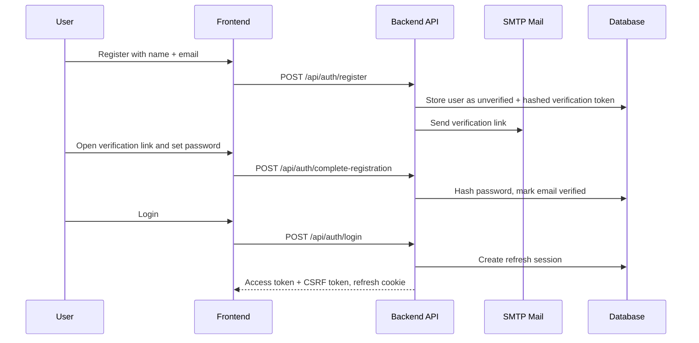

# StudyVault Security Architecture And Demo Evidence

This document is the security narrative for the IWS final project. It explains
what the system protects, how the protection is implemented, and which automated
tests prove that the behavior does not regress.

Last updated: 2026-05-02.

## Security Goals

StudyVault protects three main things:

1. Account access: only the real account owner should be able to register,
   verify email, sign in, recover password, and keep a session.
2. Private workspace data: documents, files, folders, tags, notes, and AI
   history are owner-scoped. User A must not read or modify User B's data.
3. Administration controls: admin APIs can manage normal user accounts and
   inspect audit logs, but admin privileges are not a global bypass for private
   workspace data.

## High-Level Security Model

| Layer | Mechanism | Purpose |
| --- | --- | --- |
| Transport/API boundary | CORS allowlist, Helmet, request validation | Reduce common web/API attack surface |
| Authentication | Email verification, bcrypt password hashing, JWT access token | Verify who the caller is |
| Session continuity | HttpOnly refresh cookie, server-side refresh sessions, token rotation | Keep users signed in without storing long-lived tokens in JavaScript |
| CSRF protection | `X-CSRF-Token` required for refresh/logout cookie actions | Prevent cross-site requests from silently rotating or revoking sessions |
| Authorization | `JwtAuthGuard`, `RolesGuard`, service-level owner checks | Enforce what the caller can access |
| Abuse control | Rate limiting by client IP and normalized identity fields | Slow brute force and spam against auth and expensive routes |
| Upload hardening | Type allowlist, size limit, magic-byte/content checks, filename sanitization | Prevent unsafe or misleading uploads |
| Auditability | Admin audit log | Record sensitive admin account actions |

## Authentication Flow



Key implementation points:

- Passwords are hashed with `bcrypt`.
- Verification and reset tokens are generated with `crypto.randomBytes`.
- Token hashes are stored in the database, not raw tokens.
- Public registration always creates a normal `user` role. Admin role assignment
  is not granted through the public registration flow.
- Password policy requires at least 12 characters, at most 128 characters, and
  uppercase, lowercase, number, and symbol.
- Production config validation rejects unsafe `JWT_SECRET`, wildcard CORS,
  `AUTH_RETURN_RESET_TOKEN=true`, and `DATABASE_SYNC=true`.

Relevant files:

- `studyVault-backend/src/modules/authentication/authentication.service.ts`
- `studyVault-backend/src/modules/authentication/dtos/complete-registration.dto.ts`
- `studyVault-backend/src/modules/authentication/dtos/reset-password.dto.ts`
- `studyVault-backend/src/modules/authentication/dtos/change-password.dto.ts`

## Login And Account Enumeration Protection

Login is designed to avoid leaking account state before the password is proven.

Behavior:

- Unknown email + wrong password returns `Invalid credentials`.
- Existing inactive account + wrong password returns `Invalid credentials`.
- Existing unverified account + wrong password returns `Invalid credentials`.
- Inactive/unverified state is only revealed after the password is correct.

Password recovery is also neutral:

- Unknown email returns the same public response as a real account.
- Inactive or unverified email returns the same public response.
- Reset email is only sent when the account exists, is active, and is verified.

This protects against email/account enumeration.

Automated evidence:

- `studyVault-backend/src/modules/authentication/authentication.service.spec.ts`
  - `keeps the public error neutral when inactive or unverified accounts use a wrong password`
  - `returns a neutral response without touching reset state for unknown emails`
  - `returns the same neutral response for inactive or unverified users`

## Session And Token Security

StudyVault uses short-lived access tokens plus revocable refresh sessions.

Access token:

- Returned after login or refresh.
- Contains `sub`, `role`, and `sid`.
- Default expiry is configured by `JWT_EXPIRES_IN`, currently `15m`.
- Stored in frontend memory only, not in `localStorage`. On page reload,
  the frontend rehydrates by calling refresh with the HttpOnly refresh cookie
  and `X-CSRF-Token`.

Refresh session:

- Raw refresh token is sent in an HttpOnly cookie named
  `studyvault_refresh_token`.
- Backend stores only the hash of the refresh token.
- Refresh sessions are stored server-side and can be revoked.
- Refresh token is rotated on every refresh.

CSRF:

- Backend issues a CSRF token in a non-HttpOnly cookie named
  `studyvault_csrf_token`.
- Frontend must echo the token in `X-CSRF-Token`.
- Backend stores only the hash of the CSRF token in the refresh session.
- `POST /api/auth/refresh`, `POST /api/auth/logout`, and
  `POST /api/auth/logout-all` require CSRF when a refresh cookie is involved.

Revocation:

- Logout revokes the current session.
- Logout-all revokes all sessions for the authenticated user.
- Password reset revokes all sessions for the user.
- Password change revokes all sessions for the user.
- Admin account lock revokes all sessions for the locked user.
- Reuse of an already-rotated refresh token revokes all sessions for that user.

Automated evidence:

- `studyVault-backend/src/modules/authentication/authentication.service.spec.ts`
  - `creates a revocable refresh session and signs access tokens with the session id`
  - `validates CSRF, rotates the refresh session, and issues a new access token`
  - `rejects refresh requests without the matching CSRF token`
  - `revokes all user sessions when a rotated refresh token is reused`
  - `revokes all refresh sessions after a password change`
- `studyVault-backend/test/studyvault.e2e-spec.ts`
  - `rejects refresh and logout requests with refresh cookies but no CSRF header before mutating sessions`

## Authorization Model

The full API-level matrix is documented in:

- `docs/authorization-matrix.md`

Summary:

| Actor | Access |
| --- | --- |
| Guest | Public auth flows only |
| User | Own profile and own workspace resources |
| Admin | Admin APIs plus own workspace resources |
| Locked account | Blocked before protected services execute |

Authorization is enforced in two layers:

1. Route-level guards:
   - `JwtAuthGuard` blocks guests and inactive accounts.
   - `RolesGuard` blocks non-admin users from admin-only APIs.
2. Data-level ownership checks:
   - Services query by authenticated `ownerId` / `userId`.
   - Client-provided `userId` is not trusted.
   - Cross-user resources return not-found style responses instead of revealing
     whether another user's ID exists.

## Cross-User Ownership Rules

User A cannot access User B's:

- document details
- uploaded document file
- document rename/delete/favorite state
- document tags
- folders
- folder-document assignments
- tags
- study notes
- RAG ask/history/summary/mindmap/diagram operations

Examples of enforcement:

| Resource | Enforcement |
| --- | --- |
| Folder | `FolderService` queries `{ id, ownerId }` |
| Tag | `TagService.findOwnedTag(ownerId, tagId)` |
| Document tags | `DocumentService.findUserDocumentForOwner(documentId, ownerId)` |
| Study note | note queries include `{ id: noteId, userId: ownerId }` |
| RAG operations | controllers pass authenticated `ownerId` into RAG services |

Automated evidence:

- `studyVault-backend/src/modules/security/security-regression.spec.ts`
  - `requires folder reads to match the authenticated owner`
  - `requires document organization to use a document owned by the authenticated user`
  - `requires tag updates to match the authenticated owner`
  - `requires document tag reads to match the authenticated owner`
  - `requires study note updates to match the authenticated user`
- `studyVault-backend/test/studyvault.e2e-spec.ts`
  - `passes the authenticated owner to folder ownership-sensitive routes`
  - `passes the authenticated owner to document read and related routes`
  - `passes the authenticated owner to document tag and note routes`
  - `passes the authenticated owner to tag routes`
  - `passes the authenticated owner to document RAG operations`

## Admin Security

Admin-only routes use JWT authentication plus role checks.

Admin can:

- list users
- view admin audit logs
- lock/unlock normal user accounts
- view system stats
- use admin-only LLM diagnostic endpoints

Admin cannot:

- lock their own account
- lock or unlock another admin account
- bypass normal workspace ownership rules through document/folder/tag/note APIs

Sensitive admin actions are audited.

Automated evidence:

- `studyVault-backend/src/modules/admin/admin.service.spec.ts`
  - `blocks status changes for admin accounts`
  - `records an audit log when an admin changes a user account status`
- `studyVault-backend/test/studyvault.e2e-spec.ts`
  - `rejects admin routes for non-admin users`
  - `rejects non-admin LLM test requests`

## Rate Limiting

Rate limiting protects sensitive and expensive routes.

Examples:

- login
- register
- forgot password
- complete registration
- resend verification
- reset password
- document upload
- document list
- RAG document routes

Important behavior:

- The limiter uses `req.ip` / socket address, not client-supplied
  `X-Forwarded-For`.
- Auth routes can also limit by normalized request identity such as email.
- This means an attacker cannot bypass login or recovery limits simply by
  changing `X-Forwarded-For`.

Automated evidence:

- `studyVault-backend/src/common/http/rate-limit.middleware.spec.ts`
  - `does not trust client-supplied X-Forwarded-For when generating rate limit keys`
  - `can rate-limit auth requests by normalized request identity as well as client IP`

Production note:

- Current limiter is in-memory, which is acceptable for local/demo and one
  backend instance.
- A multi-instance deployment should move this state to Redis or another shared
  store.

## Upload Security And AI Fail-Safe

Supported file types:

- PDF
- DOCX
- TXT

Upload hardening:

- Maximum file size is 10MB.
- Controller allowlists supported MIME types.
- Service validates extension and MIME type agree.
- Service validates file content:
  - PDF must start with `%PDF-`.
  - DOCX must look like a ZIP-based Word document.
  - TXT must not contain binary control bytes.
- Filename is sanitized before writing to disk.
- Empty files and unreadable files are rejected with clear messages.
- Text extraction failure returns a clear message.

AI fail-safe:

- Upload response is returned after the file and database record are saved.
- AI embedding/indexing runs in the background.
- If AI quota or provider errors occur, upload still succeeds.
- Document status transitions:
  - `ready`: document exists and is readable.
  - `indexing`: embedding generation is running.
  - `ai_failed`: AI indexing failed, but the document remains available.

Duplicate upload behavior:

- Same file content may be uploaded by the same user into different folders.
- Same file content is rejected when uploaded again into the same folder.
- After a document entry is deleted from a folder, the same file can be uploaded
  into that folder again.
- This keeps the current frontend/API contract clear because document detail
  opens by `document.id`.

Relevant files:

- `studyVault-backend/src/modules/document/document.controller.ts`
- `studyVault-backend/src/modules/document/document.service.ts`
- `studyVault-backend/src/modules/rag/services/rag-indexing.service.ts`

Automated evidence:

- `studyVault-backend/src/modules/document/document-error-messages.spec.ts`
  - `rejects a forged PDF whose bytes do not match the declared type`
  - `sanitizes uploaded file names before using them in storage paths`
- `studyVault-backend/src/modules/rag/services/rag-indexing.service.spec.ts`
  - `marks a document as ai_failed when embedding generation fails`
- `studyVault-backend/test/studyvault.e2e-spec.ts`
  - `keeps upload successful when background indexing fails`
  - `keeps upload successful when background indexing throws synchronously`
  - `rejects unsupported upload file types before they reach the service`
  - `rejects forged PDF uploads before they reach the service`

## Error Handling

Security-relevant error behavior:

- Invalid credentials remain neutral until password is proven.
- Forgot password response is neutral.
- Cross-user resource access uses not-found style errors.
- Validation errors are readable and specific.
- Upload errors explain the actionable problem:
  - unsupported type
  - file too large
  - empty/unreadable file
  - file content does not match declared type
  - no readable text extracted
- AI indexing failure does not block document upload.

## Demo Script For Security Section

Use this sequence during defense or report screenshots:

1. Register a new account with email verification.
2. Complete registration with a strong password.
3. Login and show that refresh token is stored as a cookie, not returned in
   JSON response.
4. Call a protected workspace API without token and show `401`.
5. Login as a normal user and call an admin API to show `403`.
6. Upload a valid TXT/PDF/DOCX document and open it.
7. Temporarily simulate AI provider quota failure and show upload still
   succeeds while indexing fails separately.
8. Try uploading a fake PDF and show it is rejected.
9. Show the authorization matrix and explain that all workspace APIs receive
   authenticated `ownerId`.
10. Show automated test output for unit and e2e security regression tests.

## Verification Commands

Run these before a final demo:

```powershell
cd studyVault-backend
npm run lint
npm test -- --runInBand
npm run test:e2e -- --runInBand
npm run build
```

Expected current backend coverage:

- Unit suites include authentication, admin, rate limit, upload, RAG, and
  security ownership regression tests.
- E2E suite covers auth cookies/CSRF, protected routes, admin role rejection,
  owner forwarding, upload hardening, and AI fail-safe upload behavior.

## Residual Risks And Production Notes

These are honest production considerations, not current final-project blockers:

- Rate limit state is in-memory; use Redis for multi-instance deployment.
- Refresh cookies should be sent over HTTPS in production.
- `JWT_SECRET`, SMTP credentials, and Gemini API keys must be strong and kept
  out of committed files.
- File upload hardening validates type and content signatures, but it is not a
  full malware scanner.
- Scanned/image-only PDFs are not supported until OCR is added.
- AI features depend on provider quota and API key health; document upload is
  intentionally decoupled from AI indexing to keep the core document flow stable.
